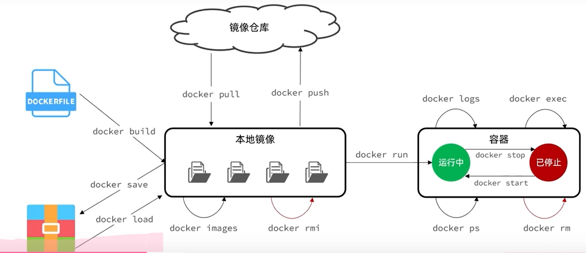

# Docker

https://hub.docker.com

```
sudo systemctl start docker     #运行Docker守护进程
sudo systemctl stop docker      #停止Docker守护进程
sudo systemctl restart docker   #重启Docker守护进程
sudo systemctl enable docker    #设置Docker开机自启动
sudo systemctl status docker    #查看Docker的运行状态
```

```
docker run -d --name mysql -p 3306:3306 -e TZ=Asia/Shanghai -e MYSQL_ROOT_PASSWORD=123 mysql
```

- docker run:
- --name mysql:
- -p 3306:3306
- -e 设置环境
- 镜像

## 常见命令

官方文档：https://docs.docker.com/


