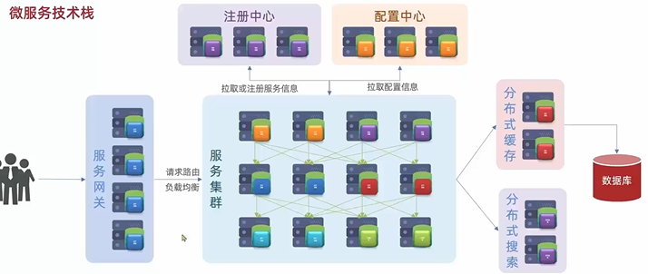
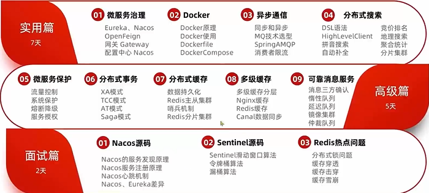
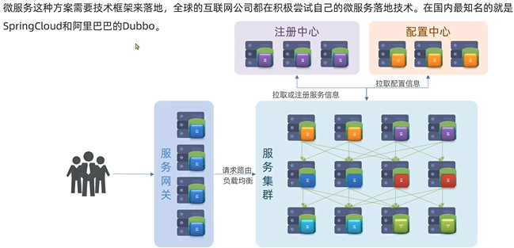
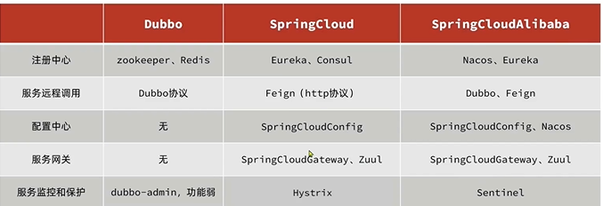
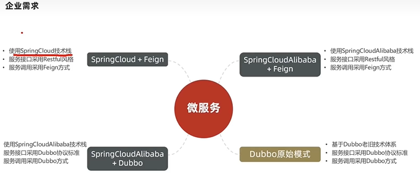
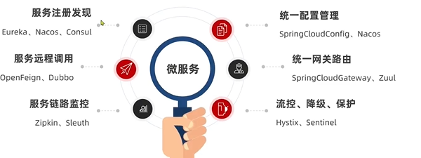
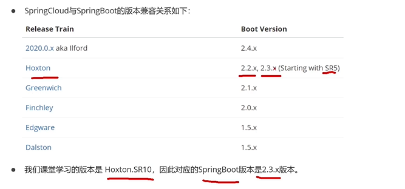

# 微服务技术栈

# SpringCloud

##### 微服务

> 微服务是一种经过良好架构设计的分布式架构方案，
>
> 微服务架构特征：
>
> - 单一职责：微服务拆分粒度更小，每一个服务都
> - 面向服务：微服务对外暴漏业务接口
> - 自治：团队独立，技术独立，数据独立，部署独立
> - 隔离性强：服务调用做好隔离、容错、降级、避免出现级联错误。

###### 单体架构：

> ###### 将业务的所有功能集中在一个项目中开发。打成一个包部署

- 优点：架构简单、部署成本低
- 缺点：耦合度高

###### 分布式架构：

> ###### 根据业务功能对系统进行拆分，每个业务模块作为独立项目开发，称为一个服务

- 优点：降低服务耦合、有利于服务拓展。

###### 服务拆分：

分布式架构要考虑的问题？

- 服务拆分粒度如何？
- 服务集群地址如何维护？
- 服务之间如何实现远程调用？
- 服务健康状态如何感知？

##### SpringCloud && Dubbo

微服务实现：

##### SpringCloud

- SpringCloud官网地址：https://spring.io/projects/spring-cloud
- SpringCloud集成了各种微服务功能呢组件，并基于SpringCloudBoot实现了这些组件的自动装配，从而提供了良好的开箱即用的体验。
- 

##### 服务拆分和远程调用

服务拆分注意事项：

1. 不同微服务，不要重复开发相同业务
2. 微服务数据独立，不要访问其他微服务的数据库
3. 微服务可以将自己的业务暴露为接口，供其他微服务调用。